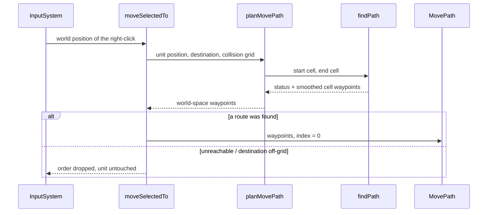
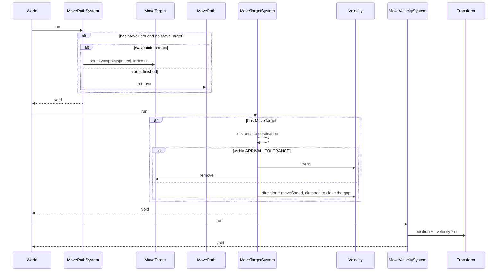

# Movement

This page documents the movement flow inside the engine: what happens between
a right-click and a unit arriving at the far side of a wall.

Combat and perception are left out to keep the focus on movement.

## The pieces

| Piece | Lives in | Responsibility |
| --- | --- | --- |
| `findPath` | `src/lib/navigation/astar.ts` | 8-way A* over a map's `collision` buffer, in **cells**. Straight steps cost 10, diagonals 14. Bounded, so an unreachable destination terminates. |
| `planMovePath` | `src/game/navigation/plan-move-path.ts` | The one seam between cells and world units: converts a world-space order into world-space waypoints. |
| `MovePath` | `src/game/ecs/types.ts` | The waypoints a unit still has to walk, plus how far along it is. |
| `MovePathSystem` | `src/game/systems/move-path-system.ts` | Hands the next waypoint to `MoveTarget`, one leg at a time. |
| `MoveTarget` | `src/game/ecs/types.ts` | The single point a unit is walking straight at right now. |
| `MoveTargetSystem` | `src/game/systems/move-target-system.ts` | Steers `Velocity` at that point, and clears the order on arrival. |
| `MoveVelocitySystem` | `src/game/systems/move-velocity-system.ts` | Integrates `Velocity` into `Transform.position`. |

A unit on a map with no terrain gets a `MoveTarget` and no `MovePath` — there
is nothing to route around, so the straight-line path is the path.

## Issuing an order

`InputSystem` drains the right-click, and `moveSelectedTo` plans a route per
selected blue unit, from wherever that unit happens to stand. An unreachable
destination leaves the unit exactly as it was rather than half-ordering it.

## Walking it

The three movement systems run in this order every fixed step, so a waypoint
handed over is steered toward and integrated within the same tick.

## Pathfinding rules worth knowing

- **Collision indexing.** A map's `collision` is a flat, row-major
  `Uint8Array` read as `collision[y * width + x]`. Every read goes through
  `isWalkable(grid, x, y)`, which takes the two axes as separate arguments —
  the original implementation indexed `map[cell.y][cell.y]` and silently
  reported the wrong terrain for every off-diagonal cell.
- **Corner cutting.** A diagonal is rejected when *both* orthogonal
  neighbours it passes between are blocked — the step would pass through a
  gap nothing can fit through. Brushing a single wall corner is allowed, so
  units hug walls instead of detouring around every corner.
- **Smoothing.** The raw cell path is reduced to the cells where it changes
  direction, using a line-of-sight test that is deliberately *stricter* than
  the corner rule above: smoothing may only ever delete waypoints from an
  already-valid route, never widen it. Crossing open ground is therefore one
  straight segment rather than a stair-step.
- **Unreachable destinations.** The search is bounded (by default, the grid's
  cell count — no search can exceed it, since each cell closes once) and
  reports `'unreachable'` or `'exhausted'` rather than hanging.
- **Destinations inside a wall.** Relocated to the nearest walkable cell, so
  clicking a wall walks up to it. `blockedDestination: 'fail'` refuses the
  order instead.

## Seeing it

`?debug=paths` draws each unit's remaining route as a white polyline from its
current position through every waypoint it has left, with a dot on each
waypoint and a larger one at the destination. On
`#/game?map=test&scenario=test&debug=paths`, right-clicking across the maze
block draws a line that bends around the wall rather than through it.
