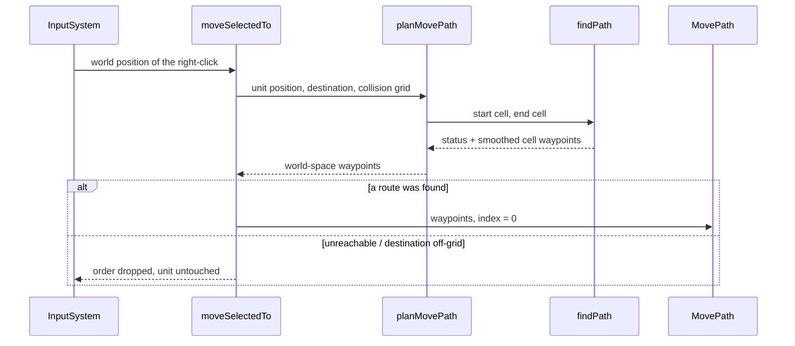
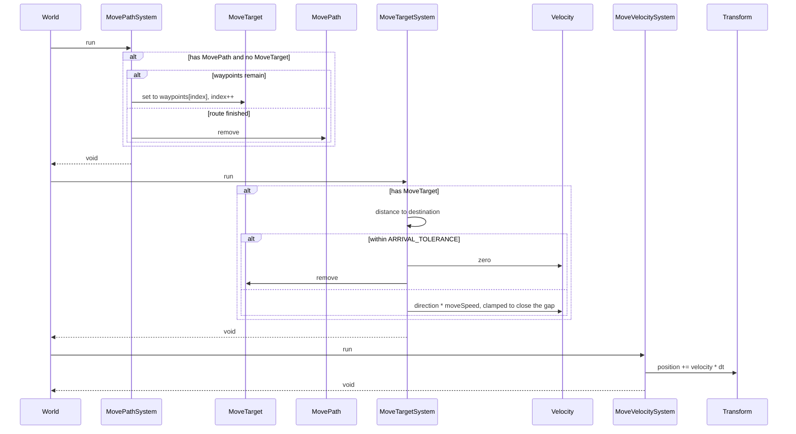

# Movement

This page documents the movement flow inside the engine: what happens between
a right-click and a unit arriving at the far side of a wall.

Combat and perception are left out to keep the focus on movement.

## The pieces

| Piece | Lives in | Responsibility |
| --- | --- | --- |
| `findPath` | `src/lib/navigation/astar.ts` | 8-way A* over a map's `collision` buffer, in **cells**. Straight steps cost 10, diagonals 14. Bounded, so an unreachable destination terminates. |
| `planMovePath` | `src/game/navigation/plan-move-path.ts` | The one seam between cells and world units: converts a world-space order into world-space waypoints. |
| `MovePath` | `src/game/ecs/types.ts` | The waypoints a unit still has to walk, plus how far along it is. |
| `MovePathSystem` | `src/game/systems/move-path-system.ts` | Hands the next waypoint to `MoveTarget`, one leg at a time. |
| `MoveTarget` | `src/game/ecs/types.ts` | The single point a unit is walking straight at right now. |
| `MoveTargetSystem` | `src/game/systems/move-target-system.ts` | Steers `Velocity` at that point, and clears the order on arrival. |
| `MoveVelocitySystem` | `src/game/systems/move-velocity-system.ts` | Integrates `Velocity` into `Transform.position`. |

A unit on a map with no terrain gets a `MoveTarget` and no `MovePath` — there
is nothing to route around, so the straight-line path is the path.

A **cell** is half of one of the loaded map's tiles on each axis: the cell
size is half the map's tile size (`cellSizeOf` in `src/lib/grid.ts` — 16 px
on the hand-authored 32 px maps, 20 px on the converted 40 px county maps,
16 px with no map), so an infantry unit gets a cell of its own. Units are
placed on, routed through and collide in this grid; `createMapNavigation`
(`src/game/navigation/map-navigation.ts`) upsamples the terrain's per-tile
collision onto it once (a blocked tile blocks its 2x2 cells) and sets up
pathfinding and occupancy for any tile size. Most units occupy exactly one
cell; a unit may instead carry an explicit `footprint` (`width` x `height`
cells — see `footprintOf` in `src/game/data/units.ts`), which the knight
does: a 2x2 block. A unit's position is always the centre of its footprint
rectangle — a cell centre for a 1x1 unit, the shared corner of its cells for
the knight's 2x2 block — never `(cell + 0.5) * cellSize` for a multi-cell
unit; see `src/game/navigation/footprint.ts` for the shared helpers
(`footprintCentre`, `anchorCellAt`, `snapToFootprint`, `isAtFootprintCentre`,
`footprintGap`) every world<->cell conversion for a unit goes through, and
`OccupancyGrid.reserveBlock`/`releaseBlock` for how a footprint's cells are
claimed and released atomically.

Unit data (`movementSpeed`, `range`, `aggroRange`, `size`) is authored in
tiles and converted in one place, `spawnUnit` (`src/game/data/spawn.ts`), so
a unit covers the same world distance whatever the cell size; a melee
`range` of 1 means an adjacent cell — or, for a multi-cell unit, the
footprint-to-footprint gap of 1 the attacker and target touch at
(`footprintGap`), diagonals included.

## Issuing an order

`InputSystem` drains the right-click, and `moveSelectedTo` plans a route per
selected blue unit, from wherever that unit happens to stand. An unreachable
destination leaves the unit exactly as it was rather than half-ordering it.

```mermaid
sequenceDiagram
  InputSystem ->> moveSelectedTo: world position of the right-click
  moveSelectedTo ->> planMovePath: unit position, destination, collision grid
  planMovePath ->> findPath: start cell, end cell
  findPath -->> planMovePath: status + smoothed cell waypoints
  planMovePath -->> moveSelectedTo: world-space waypoints
  alt a route was found
    moveSelectedTo ->> MovePath: waypoints, index = 0
  else unreachable / destination off-grid
    moveSelectedTo -->> InputSystem: order dropped, unit untouched
  end
```

## Walking it

The three movement systems run in this order every fixed step, so a waypoint
handed over is steered toward and integrated within the same tick.

```mermaid
sequenceDiagram
  World ->> MovePathSystem: run
  alt has MovePath and no MoveTarget
    alt waypoints remain
      MovePathSystem ->> MoveTarget: set to waypoints[index], index++
    else route finished
      MovePathSystem ->> MovePath: remove
    end
  end
  MovePathSystem -->> World: void

  World ->> MoveTargetSystem: run
  alt has MoveTarget
    MoveTargetSystem ->> MoveTargetSystem: distance to destination
    alt within ARRIVAL_TOLERANCE
      MoveTargetSystem ->> Velocity: zero
      MoveTargetSystem ->> MoveTarget: remove
    else
      MoveTargetSystem ->> Velocity: direction * moveSpeed, clamped to close the gap
    end
  end
  MoveTargetSystem -->> World: void

  World ->> MoveVelocitySystem: run
  MoveVelocitySystem ->> Transform: position += velocity * dt
  MoveVelocitySystem -->> World: void
```

## Pathfinding rules worth knowing

- **Collision indexing.** A map's `collision` is a flat, row-major
  `Uint8Array` read as `collision[y * width + x]`. Every read goes through
  `isWalkable(grid, x, y)`, which takes the two axes as separate arguments —
  the original implementation indexed `map[cell.y][cell.y]` and silently
  reported the wrong terrain for every off-diagonal cell.
- **Corner cutting.** A diagonal is rejected when *both* orthogonal
  neighbours it passes between are blocked — the step would pass through a
  gap nothing can fit through. Brushing a single wall corner is allowed, so
  units hug walls instead of detouring around every corner.
- **Smoothing.** The raw cell path is reduced to the cells where it changes
  direction, using a line-of-sight test that is deliberately *stricter* than
  the corner rule above: smoothing may only ever delete waypoints from an
  already-valid route, never widen it. Crossing open ground is therefore one
  straight segment rather than a stair-step.
- **Unreachable destinations.** The search is bounded (by default, the grid's
  cell count — no search can exceed it, since each cell closes once) and
  reports `'unreachable'` or `'exhausted'` rather than hanging.
- **Destinations inside a wall.** Relocated to the nearest walkable cell, so
  clicking a wall walks up to it. `blockedDestination: 'fail'` refuses the
  order instead.
- **Wide units and A*.** `findPath` itself only ever plans a single-cell
  path, and stays that way: a multi-cell unit is routed by its anchor
  (top-left) cell over a **block grid**, where an anchor is blocked whenever
  any cell of the width x height block it anchors is terrain, off the map or
  (for repaths) held by another unit (`blockAnchorGrid` in
  `src/game/navigation/block-grid.ts`). Every node A* expands is then a
  placement where the whole block fits, so a knight is only sent through
  gaps its 2x2 block fits, and an order with no such route is refused
  (`'unreachable'`) instead of becoming a path it would stall on. A 1x1
  footprint's block grid is the input grid itself, so single-cell units route
  exactly as before. `planMovePath` shifts the anchor cell back onto block
  centres (see above) and takes the block grid as its `grid`.
  - Diagonal steps need no extra rule. A* already refuses a diagonal unless
    both orthogonal neighbours are free; on the block grid that means three
    free blocks, and the block at the step's target covers every cell the
    diagonal newly enters — the very cells `CellOccupancySystem` reserves
    before stepping. A planned step is therefore never one the occupancy
    system refuses.
  - A blocked destination (`blockedDestination: 'nearest'`) relocates over the
    block grid too, to the nearest anchor whose whole block is walkable.
  - Where the grids come from: `planMoveOrder` (move orders, the pending-order
    and pursuit plans, and the `?debug=paths` preview) uses `terrainBlockGrid`,
    built once per terrain grid and footprint size and cached for as long as the
    map's grid lives. `CellOccupancySystem`'s repath around units uses
    `OccupancyGrid.asBlockedGridExcluding(occupantId, size)`, a fresh
    snapshot per repath: a copy of the cached terrain block grid plus the
    anchors covered by each cell another unit holds. That is a full-grid pass
    (one scan of the occupant array and a buffer copy, the same as the
    single-cell snapshot) plus marking proportional to how many cells other
    units hold; it only runs on the rare repath, never per tick.
  - `SeekSystem`'s straight-line "clear line to the attack cell" shortcut
    walks the same block grid for a multi-cell unit, so it only heads
    straight for a cell when its whole footprint fits along the line;
    otherwise it plans a route like any other order.
  - Not covered: hierarchical or downsampled pathfinding (the block grid
    keeps the existing A* and cell resolution), formation and group-move
    spacing for larger units, and footprints that rotate with facing.

## Seeing it

`?debug=paths` draws each unit's remaining route as a white polyline from its
current position through every waypoint it has left, with a dot on each
waypoint and a larger one at the destination. On
`#/game?map=test&scenario=test&debug=paths`, right-clicking across the maze
block draws a line that bends around the wall rather than through it.
